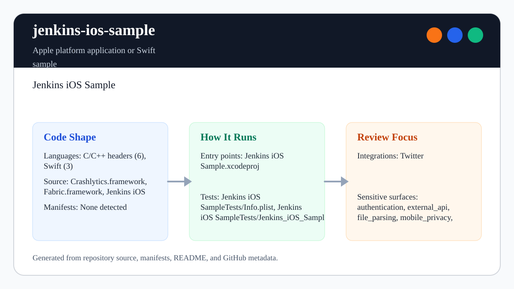

# jenkins-ios-sample

<!-- README-OVERVIEW-IMAGE -->


## Overview

`garethpaul/jenkins-ios-sample` is an Apple platform application or Swift sample. Jenkins iOS Sample

This README is based on the checked-in source, manifests, scripts, and repository metadata on the `master` branch. The project language mix found during review was: C/C++ headers (6), Swift (3).

## Repository Contents

- `Crashlytics.framework` - source or example code
- `Fabric.framework` - source or example code
- `VENDORED_FRAMEWORKS.sha256` - exact digests for the retired framework,
  installer, and submission executables; drift detection does not establish
  provenance or make the SDK production-safe
- `Jenkins iOS Sample` - source or example code
- `Jenkins iOS Sample.xcodeproj` - Xcode project file
- `Jenkins iOS SampleTests` - source or example code
- `CHANGES.md` - recent maintenance changes
- `Makefile` - local static and executable XCTest entry points
- `scripts/check-baseline.py` - static Fabric/Crashlytics baseline checks
- `SECURITY.md` - security reporting and disclosure guidance
- `VISION.md` - project direction and maintenance guardrails

Additional scan context:

- Source directories: Crashlytics.framework, Fabric.framework, Jenkins iOS Sample, Jenkins iOS Sample.xcodeproj, Jenkins iOS SampleTests
- Dependency and build manifests: none detected
- Entry points or build surfaces: `make lint`, `make test`, `make build`, `make check`, Jenkins iOS Sample.xcodeproj
- Test-looking files: Jenkins iOS SampleTests/Info.plist, Jenkins iOS SampleTests/Jenkins_iOS_SampleTests.swift

## Getting Started

### Prerequisites

- Git
- Python 3 for static verification with `make lint`, `make build`, and `make check`
- macOS with Xcode for the complete `make test` simulator gate

### Setup

```bash
git clone https://github.com/garethpaul/jenkins-ios-sample.git
cd jenkins-ios-sample
make lint
make test
make build
make check
```

The Make gates are location-independent. From another directory, pass this
checkout's Makefile by absolute path, for example:

```bash
make -f /path/to/jenkins-ios-sample/Makefile check
```

The setup commands above are derived from repository files. Legacy mobile, Python, or JavaScript samples may require older SDKs or package versions than a modern workstation uses by default.

For CI or local Xcode builds that run Fabric, provide `FABRIC_API_KEY` and
`CRASHLYTICS_BUILD_SECRET` through CI secrets, xcodebuild settings, or a local
ignored xcconfig based on `Jenkins iOS Sample/FabricKeys.xcconfig.example`.

## Running or Using the Project

- Open `Jenkins iOS Sample.xcodeproj` in Xcode, choose the app or sample scheme, and run it on the matching simulator/device.
- The app initializes Fabric with Crashlytics. If the required build settings are missing, the Fabric run script skips instead of using committed credentials.
- The build script placeholder guard also skips unresolved, named, example, or
  replacement placeholder values before invoking the vendored Fabric script.
- The build script also trims CI-provided Fabric values so whitespace-only CI
  secrets skip the vendored Fabric script instead of being treated as
  configured credentials.
- The build script rejects embedded whitespace remaining after trimming either
  credential so malformed tokens do not reach the vendored Fabric script.
- The build script requires a 40-hex Fabric API key and a 64-hex Crashlytics
  build secret, rejecting control characters, non-hex values, and wrong-length
  credentials before the vendored script runs.
- Runtime Fabric initialization also skips when the app plist still contains an empty, whitespace-only, embedded whitespace, Unicode control character, placeholder, embedded placeholder, or named placeholder fragment API key.
- Testable Fabric API key validation keeps the runtime guard covered by XCTest cases for missing, blank, embedded whitespace, Unicode control characters, embedded placeholder fragments, named placeholder fragments, case-insensitive placeholder values, and trimmed real values.
- The Xcode scheme is shared under `xcshareddata/xcschemes` so Jenkins and
  command-line `xcodebuild` can discover it without developer-specific
  `xcuserdata`.
- The project uses Swift 5 with an iOS 12 deployment floor so current Xcode can
  compile the preserved sample and its tests.

## Testing and Verification

- `make lint`, `make build`, and `make check` run `scripts/check-baseline.py`, which verifies Xcode project wiring, committed plists, storyboard and asset parsing, Fabric/Crashlytics framework references and digests, placeholder build settings, build script placeholder guarding, runtime placeholder API key guarding, Swift 5 settings, XCTest wiring, and CI secret documentation.
- `make test` runs the static baseline and, when Xcode is available, uses
  `scripts/run-tests.sh` to select an available iPhone simulator by UDID,
  explicitly boot it with one bounded recovery attempt, and execute the Fabric
  API key validation XCTest suite without code signing or parallel workers.
- Set `IOS_DESTINATION` for a complete xcodebuild destination or
  `IOS_SIMULATOR_NAME` for a specific available iPhone simulator.
- Pinned `macos-15` GitHub Actions runs the complete `make test` gate with
  persisted checkout credentials disabled and a bounded fifteen-minute job.
  It receives no Fabric/Crashlytics secrets, so the guarded vendored build
  script and runtime initialization skip rather than uploading symbols or
  crash reports.

When the required SDK or runtime is unavailable, use static checks and source review first, then verify on a machine that has the matching platform toolchain.

## Configuration and Secrets

- Fabric and Crashlytics values belong in CI secret storage, local keychains, xcodebuild settings, or ignored local configuration only.
- Do not commit Fabric API keys, Crashlytics build secrets, signing identities, provisioning profiles, `.env` files, or local xcconfig files.
- Local builds with a placeholder API key should skip Fabric initialization instead of starting Crashlytics with unresolved configuration.

## Security and Privacy Notes

- Review changes touching authentication or token handling; examples from the scan include Crashlytics.framework/Headers/CLSLogging.h, Crashlytics.framework/Headers/CLSReport.h.
- Review changes touching `FABRIC_API_KEY`, `CRASHLYTICS_BUILD_SECRET`, signing, provisioning, or the Fabric run script as CI-secret changes.
- Review changes touching external API calls or credential-adjacent configuration; examples from the scan include Crashlytics.framework/Headers/Crashlytics.h, Crashlytics.framework/Info.plist, Fabric.framework/Headers/FABAttributes.h, Fabric.framework/Headers/Fabric.h, and 2 more.
- Review changes touching network requests, sockets, or service endpoints; examples from the scan include Crashlytics.framework/Headers/Crashlytics.h, Crashlytics.framework/Info.plist, Fabric.framework/Info.plist, Jenkins iOS Sample/Info.plist, and 2 more.
- Review changes touching mobile permissions or privacy-sensitive device data; examples from the scan include Crashlytics.framework/Headers/Crashlytics.h.
- Review changes touching file, media, JSON, XML, CSV, OCR, or data parsing; examples from the scan include Crashlytics.framework/Headers/Crashlytics.h, Crashlytics.framework/Info.plist, Fabric.framework/Info.plist, Jenkins iOS Sample/Info.plist, and 2 more.

## Maintenance Notes

- This looks like an Apple platform project or sample. Xcode, Swift, CocoaPods, and deployment target versions may need to match the original project era.
- Run `make lint`, `make test`, `make build`, and `make check` before pushing Swift, plist, project, framework-reference, CI-secret, or documentation changes.
- The same gates can run outside the checkout with an absolute Makefile path,
  such as `make -f /path/to/jenkins-ios-sample/Makefile check`.
- See `SECURITY.md` for vulnerability reporting and safe research guidance.
- See `VISION.md` for project direction and contribution guardrails.
- See `docs/plans/2026-06-09-make-gate-aliases.md` for the local gate alias guardrail.
- See `docs/plans/2026-06-12-hosted-xctest.md` for the Swift 5, simulator
  discovery, and hosted XCTest contract.
- See `docs/plans/2026-06-12-hosted-simulator-startup-reliability.md` for the
  bounded simulator boot and recovery contract.

## Contributing

Keep changes small and tied to the project that is already present in this repository. For code changes, document the toolchain used, avoid committing generated dependency directories or local configuration, and update this README when setup or verification steps change.
